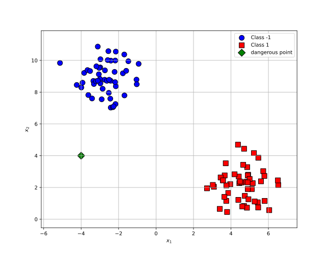

## Before we get started

SVM is easily *my favorite* machine learning algorithm—no "one of" needed. In fact, I started the whole **Wandering ML** series because one day it struck me that I had to write something about SVM. It's simple, elegant, and powerful.

I first heard about SVM during my early college years. At the time, I knew nothing about machine learning and was obsessively into signal processing (you wouldn’t believe how crazy I was about the Fourier transform). Later, after moving to the U.S., I took a machine learning course. The moment I saw the instructor derive the Lagrange dual problem (which I later learned is a common technique in convex optimization), I thought: “Wow, this is so cool.”

I still remember how fascinated I was when I finally understood the core idea of SVM. That fascination only deepened when I encountered learning theory—thanks to Dr. Vapnik. Hopefully, after reading this SVM series, you’ll share a bit of that excitement too.

## Motivation
Suppose our data is linearly separable. We can draw a line that perfectly separates the two classes. Then we’re done, right?

<figure>

<figcaption>Fig. 1. Infinite decision boundaries for linearly separable data</figcaption>
</figure>

Well, not quite. There are infinitely many lines that can separate the classes without error. As shown in the figures below, all three lines separate the data perfectly. But which one is the best?

<figure>
<figcaption>Fig. 2. Three different decision boundaries for the same data</figcaption>
</figure>
Let’s introduce a new data point—a ‘dangerous point’ with label -1.

<figure>

<figcaption>Fig. 3. A "dangerous point"</figcaption>
</figure>

How do the classifiers behave with this new point?

+ Classifier (a)? It misclassifies the point.
+ Classifier (c)? It gets it right.

Classifier (c) is more robust to this tricky example. In practice, we want all classifiers to behave like (c), avoiding such misclassifications whenever possible. But the question is, why is the third classifier more robust? What makes it safer?

Here’s the key: **the margin**. The third classifier has a wider margin than the other two. The wider the margin, the more robust the classifier is to noise and outliers.

## What is a margin?

Let’s start with a simple analogy. Imagine driving on a two-lane road, one lane per direction. If the road is wide, you feel safe driving in your lane without worrying about the car coming from the opposite direction. But if the road is narrow, you must drive more carefully, keeping a safe distance.

<figure>

<figcaption>Fig. 4. A two-lane road</figcaption>
</figure>

We feel safer on wider roads, and classifiers feel the same. A margin acts like a *buffer zone*. The wider the margin, the more robust the classifier becomes to noise and outliers.

Let’s formalize this idea.

In SVMs, the margin is defined as the **minimum distance** from the decision boundary to all the training data. In other words, it quantifies the “space” that separates the two classes.
<figure>

<figcaption>Fig. 5. Max-margin classifier</figcaption>
</figure>

## Size of the margin

Now that we know what a margin is, let’s see how to compute its size mathematically.

By definition, it is the distance from the decision boundary to the closest data point. Sound familiar? It’s the classic high-school formula for the distance from a point to a hyperplane.

The decision boundary is defined as 

$$
\mathbf{w}^\top \mathbf{x} + b = 0
$$

What is the distance from a point to a line? Let's say we have an arbitrary data point $(\mathbf{x}, y)$ and a line defined by the equation $\mathbf{w}^\top \mathbf{x} + b = 0$. $\mathbf{x_p}$ is the projection of $\mathbf{x}$ on the line. $\mathbf{w}$ is the normal vector of the line.

<figure>

<figcaption>Fig. 6. Distance of a point to a line.</figcaption>
</figure>

We consider the vector between $\mathbf{x}$ and its projection $\mathbf{x_p}$. Then the distance $d$ from the point to the line is given by:

$$
d\cdot \frac{\mathbf{w}}{\|\mathbf{w}\|} = y\cdot(\mathbf{x} - \mathbf{x_p})
$$

Think about it: what is the label $y$ here?

✅ Click to reveal the answer

$y$ is the label of the point $\mathbf{x}$. If $\mathbf{x}$ is a positive point, then $y=1$. If $\mathbf{x}$ is a negative point, then $y=-1$. Since the normal vector $\mathbf{w}$ is pointing in the direction of the positive class, we multiply $(\mathbf{x} - \mathbf{x_p})$ by $y$ to ensure that the distance is positive. This way, we can always get a positive distance regardless of the class of the point $\mathbf{x}$.

Multiplying both sides by $\mathbf{w}$, we have:
$$
d\cdot \frac{\mathbf{w}^\top\mathbf{w}}{\|\mathbf{w}\|} = y\cdot((\mathbf{w}^\top\mathbf{x}+b) - (\mathbf{w}^\top\mathbf{x_p}+b))
$$

Since $\mathbf{x_p}$ is on the line, we have:
$$
\mathbf{w}^\top \mathbf{x_p} + b = 0
$$
Hence, we can rewrite the above equation as:
$$
y\cdot(\mathbf{w}^\top \mathbf{x} + b) = d\cdot \|\mathbf{w}\|
$$
Then we have:
$$
d = y\cdot\frac{\mathbf{w}^\top \mathbf{x} + b}{\|\mathbf{w}\|}
$$

Since the margin is defined as **the minimum distance from all training data to the decision boundary**, we can write:

$$
\text{margin} = \min_{i} \left( y_i\cdot\frac{\mathbf{w}^\top \mathbf{x_i} + b}{\|\mathbf{w}\|} \right)
$$

Then the problem of maximizing the margin or the distance from all training data to the decision boundary can be formulated as:
$$
\max_{\mathbf{w}, b} \min_{i} \left( y_i\cdot\frac{\mathbf{w}^\top \mathbf{x_i} + b}{\|\mathbf{w}\|} \right)
$$

Notice that we can always rescale the vector $\mathbf{w}$ and the bias $b$ by a constant factor without changing the decision boundary. Therefore, it suffices to set
the normal vector $\mathbf{w}$ such that $\min_i y_i\cdot(\mathbf{w}^\top \mathbf{x_i} + b)=1$

This leads to the following optimization problem:
$$
\max_{\mathbf{w}, b} \frac{1}{\|\mathbf{w}\|} \quad \text{s.t.} \quad \forall i,y_i\cdot(\mathbf{w}^\top \mathbf{x_i} + b) \geq 1
$$

## Conclusion
In this post, we introduced the concept of margin in SVMs. We also saw how to calculate the margin and why maximizing it leads to more robust classifiers.

In the next post, we will discuss how to find the maximum margin classifier and how to solve the optimization problem using Lagrange multipliers. We will also handle the case of non-linearly separable data.

> Code and plots are available in the [GitHub repository](https://github.com/RaphelWei/blog-codebase/tree/main/ml-notes/svm-series)
