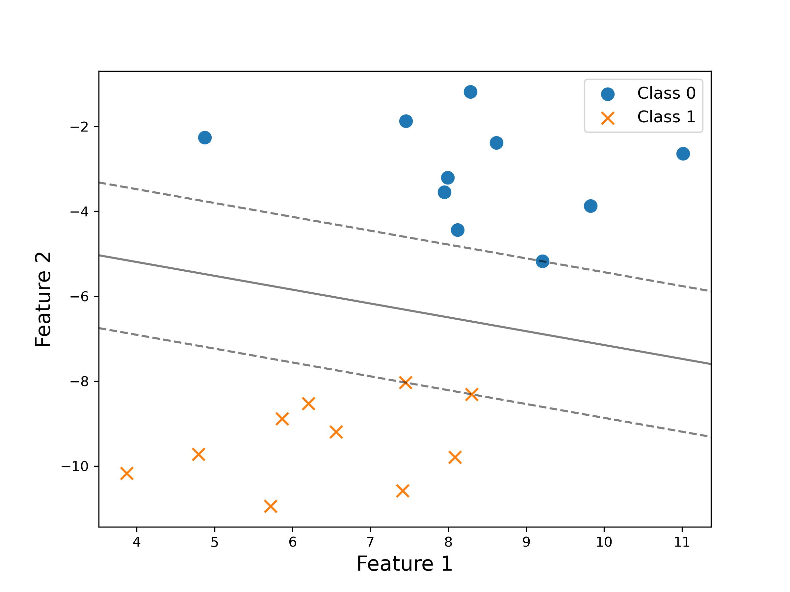
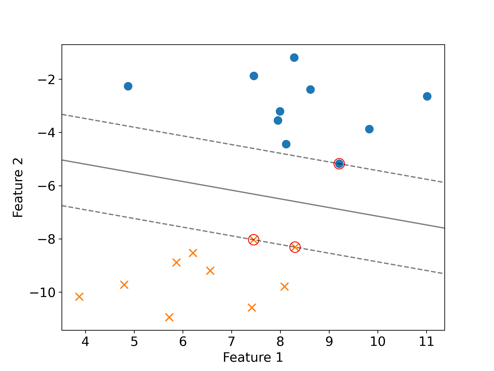
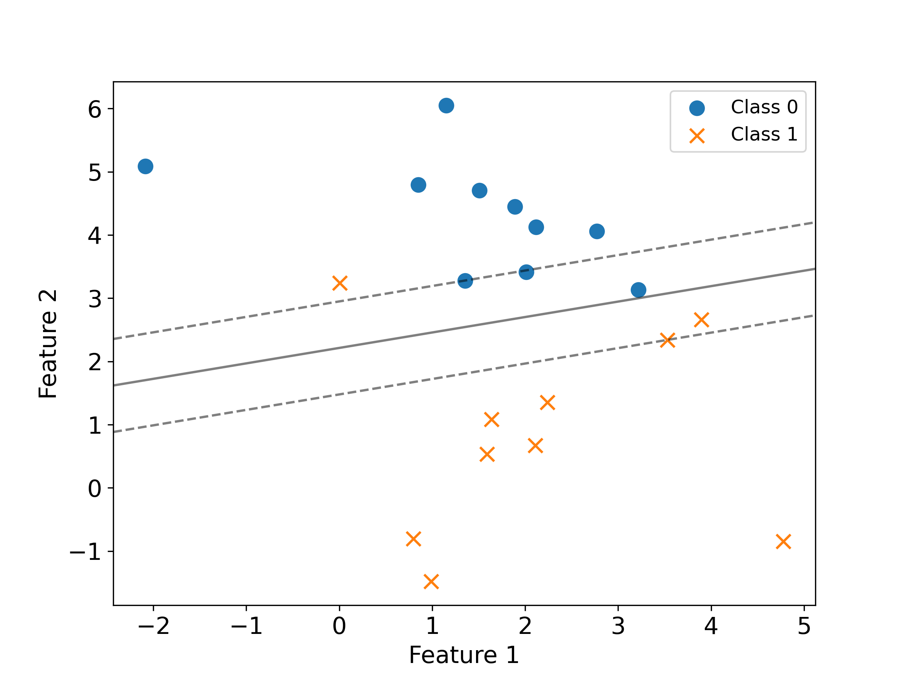
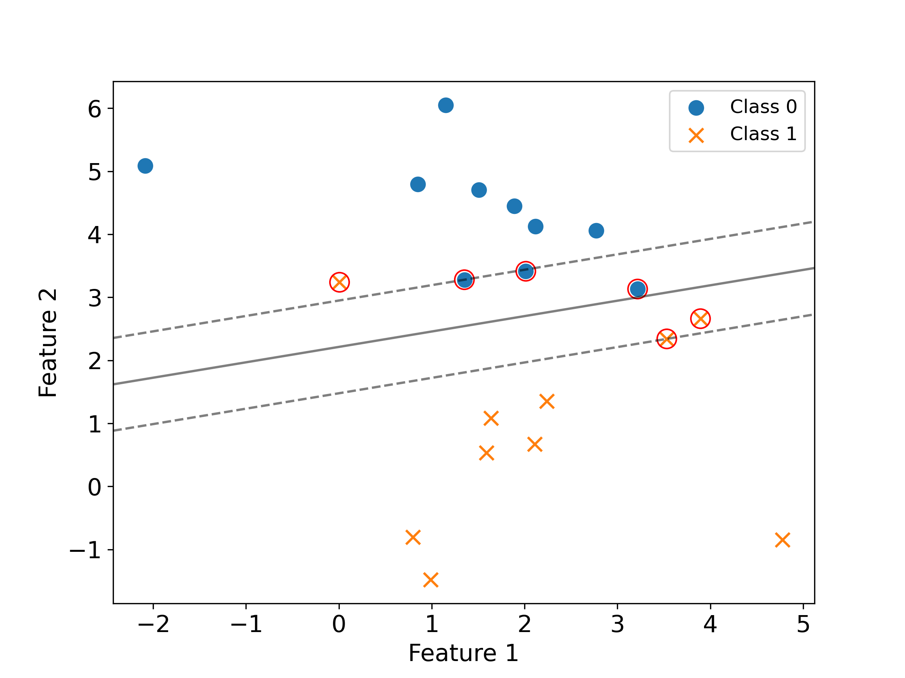

## Motivation

As a former TA for machine learning courses—and a learner myself—I’ve noticed that many beginners encounter support vectors as abstract definitions in lecture slides or textbooks. While technically correct, these explanations often lack a visual or intuitive component, making it difficult to see which data points actually matter in practice.

This post is my attempt to bridge that gap. We’ll revisit what support vectors are, why they matter, and—most importantly—how to recognize them visually. By the end, you should be able to look at the plot of a trained SVM and confidently identify the support vectors: the handful of data points that directly define the decision boundary.

---

## The Role of Lagrange Multipliers

In the SVM framework, each training data point is associated with a Lagrange multiplier, denoted as \\(\alpha_i\\). The decision boundary is computed as:

\\[
\mathbf{w}^* = \sum_{i=1}^n \alpha_i y_i \mathbf{x}_i
\\]

Only those data points for which \\(\alpha_i > 0\\) contribute to this sum. In other words, if a data point’s corresponding multiplier is zero, it has no impact on the decision boundary. These influential points are what we call **support vectors**.

---

## Support Vectors in Hard-Margin SVM

For datasets that are perfectly separable, we use a hard-margin SVM. Here, the complementary slackness condition tells us:

\\[
\alpha_i(1 - y_i\mathbf{w}^\top\mathbf{x}_i) = 0
\\]

This equation means that for points *not* on the margin (where \\(y_i\mathbf{w}^\top\mathbf{x}_i > 1\\)), the multiplier \\(\alpha_i\\) must be 0. Hence, only those points that lie exactly *on* the margin (where \\(y_i\mathbf{w}^\top\mathbf{x}_i = 1\\)) have non-zero multipliers and are thus support vectors.

### Try yourself!

Can you identify the support vectors in the plot below?

<figure>

<figcaption>Hard-Margin SVM</figcaption>
</figure>

<details>
<summary>✅ Click to reveal the answer</summary>

There are **3** support vectors in the plot above. These are the data points that lie *exactly* on the margin boundaries. They are the only points with non-zero Lagrange multipliers $\alpha_i > 0$ and directly influence the position of the decision boundary.

<figure>

<figcaption>Support Vectors in Hard-Margin SVM</figcaption>
</figure>

</details>

### Code for generating the plots
Want to experiment yourself? Below is the full code used to generate the plots. Try adjusting the `random_state` in `make_blobs` to generate different datasets and see how the support vectors change!

```python
import numpy as np
import matplotlib.pyplot as plt
from sklearn import datasets
from sklearn.svm import SVC

# Generate a dataset
X, y = datasets.make_blobs(n_samples=20, centers=2, random_state=6, cluster_std=1.2)

# Create a soft margin SVM classifier
svm = SVC(C=1.0, kernel='linear')
svm.fit(X, y)

# Plot the data
plt.figure(figsize=(8, 6))
markers=['o', 'x']
# plt.scatter(X[:, 0], X[:, 1], c=y, cmap=plt.cm.Paired, marker='o', edgecolors='k')
for class_value, marker in zip(np.unique(y), markers):
    plt.scatter(X[y == class_value, 0], X[y == class_value, 1], s=80,
                marker=marker, 
                label=f"Class {class_value}")

# Plot the decision boundary
ax = plt.gca()
xlim = ax.get_xlim()
ylim = ax.get_ylim()

# Create grid to evaluate model
xx = np.linspace(xlim[0], xlim[1], 30)
yy = np.linspace(ylim[0], ylim[1], 30)
YY, XX = np.meshgrid(yy, xx)
xy = np.vstack([XX.ravel(), YY.ravel()]).T
Z = svm.decision_function(xy).reshape(XX.shape)

# Plot decision boundary and margins
ax.contour(XX, YY, Z, colors='k', levels=[-1, 0, 1], alpha=0.5,
           linestyles=['--', '-', '--'])

num_support_vectors = svm.support_vectors_.shape[0]
print(f'The number of suppost vectors is {num_support_vectors}.')

# Highlight the support vectors
sv = svm.support_vectors_
ax.scatter(sv[:, 0], sv[:, 1], s=150, linewidth=1, facecolors='none', edgecolors='red')
plt.tick_params(axis='both', labelsize=15)

plt.xlabel('Feature 1', fontsize=15)
plt.ylabel('Feature 2', fontsize=15)
# plt.savefig('hard_margin_marked.png', dpi=300)
plt.legend(fontsize=12)
plt.show()
```


---

## Support Vectors in Soft-Margin SVM

When data is not perfectly separable, SVMs use a soft-margin approach with slack variables \\(\xi_i\\). The complementary slackness and KKT conditions become:

\[
\alpha_i(1 - y_i\mathbf{w}^\top\mathbf{x}_i - \xi_i) = 0 \\
(C - \alpha_i)\xi_i = 0
\]

We then encounter two cases:

1. **\\(\alpha_i > 0\\), \\(\xi_i = 0\\):**  
   The point lies exactly on the margin border. It is a **support vector**.

2. **\\(\alpha_i > 0\\), \\(\xi_i > 0\\):**  
   The point is either inside the margin or misclassified. Here, \\(\alpha_i = C\\). These points also influence the decision boundary and are **support vectors**.

In contrast, points with \\(\alpha_i = 0\\) lie far from the margin and do **not** affect the model.

### Try yourself!

Can you identify the support vectors in the plot below?

<figure>

<figcaption>Soft-Margin SVM</figcaption>
</figure>

<details>
<summary>✅ Click to reveal the answer</summary>

There are **6** support vectors in the plot above. In the soft-margin setting, support vectors are the data points with non-zero Lagrange multipliers $\alpha_i > 0$. These include:
+ Points lying exactly on the margin boundaries
+ Points that are within the margin
+ Points that are misclassified (on the wrong side of the decision boundary)

Only these points influence the position of the decision boundary. Points farther away from the margin have $\alpha_i = 0$ and do not contribute.

<figure>

<figcaption>Support Vectors in Soft-Margin SVM</figcaption>
</figure>

</details>


### Code for generating the plots

```python
import numpy as np
import matplotlib.pyplot as plt
from sklearn import datasets
from sklearn.svm import SVC


# Adjusting the dataset to be linearly nonseparable for a soft-margin linear SVM
X, y = datasets.make_blobs(n_samples=20, centers=2, random_state=0, cluster_std=1.2)

# Create a soft margin SVM classifier with a linear kernel for the adjusted dataset
svm_linear_soft = SVC(C=1, kernel='linear')  # Adjusting C for a softer margin
svm_linear_soft.fit(X, y)

# Plot the data
plt.figure(figsize=(8, 6))
markers=['o', 'x']
# plt.scatter(X[:, 0], X[:, 1], c=y, cmap=plt.cm.Paired, marker='o', edgecolors='k')
for class_value, marker in zip(np.unique(y), markers):
    plt.scatter(X[y == class_value, 0], X[y == class_value, 1], s=80,
                marker=marker, 
                label=f"Class {class_value}")

# Plot the decision boundary
ax = plt.gca()
xlim = ax.get_xlim()
ylim = ax.get_ylim()

# Create grid to evaluate model
xx = np.linspace(xlim[0], xlim[1], 30)
yy = np.linspace(ylim[0], ylim[1], 30)
YY, XX = np.meshgrid(yy, xx)
xy = np.vstack([XX.ravel(), YY.ravel()]).T
Z = svm_linear_soft.decision_function(xy).reshape(XX.shape)

# print the number of support vectors
num_support_vectors = svm_linear_soft.support_vectors_.shape[0]
print(f'The number of support vectors is {num_support_vectors}.')

# Plot decision boundary and margins
ax.contour(XX, YY, Z, colors='k', levels=[-1, 0, 1], alpha=.5,
           linestyles=['--', '-', '--'])


# Highlight the support vectors
sv = svm_linear_soft.support_vectors_
ax.scatter(sv[:, 0], sv[:, 1], s=150, linewidth=1, facecolors='none', edgecolors='red')


plt.tick_params(axis='both', labelsize=15)

plt.xlabel('Feature 1', fontsize=15)
plt.ylabel('Feature 2', fontsize=15)
plt.legend(fontsize=12)
# plt.savefig('soft_margin_marked.png', dpi=300)
plt.show()
```
---
## Conclusion

Support vectors are not just a technical detail in SVMs—they are the essential data points that shape the decision boundary. Whether you’re working with a hard-margin or soft-margin SVM, the concept remains the same:
Only the data points with non-zero Lagrange multipliers ($\alpha_i > 0$) influence the final classifier.


By now, you should be able to look at an SVM plot and confidently pick out the support vectors, understanding exactly why they matter.
